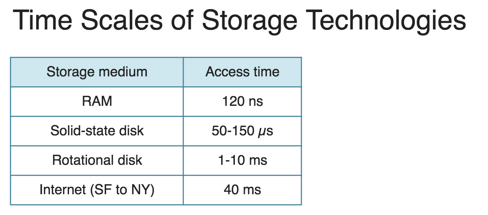

### Parallel Computing with Dask

These notes are from Data Camp course: parallel computing with dask




With the python interpreter:

- Get the process identifier
```sh
$ os.getpid()
```

- Get memory usage (in bytes) with this pid
```sh
$ plutil.Process(os.getpid()).memory_info().rss
```
- Get memory usage (in bytes) of numpy array
```sh
$ np.nbytes
```

- Get memory usage(in bytes) of pandas dataframe
```sh
$ df.memory_usage()
```
or
```sh
$ df.info()
```

### Chapter 1: Working with big data
- only chunk size of data will be in memory at a time.. so big data can be manageable… note that chunk size should not be too small - in that case, IO cost will be high to overcome the benefit
```sh
$ pd.read_csv(data, chunk size = ?) 
```
- Generators use lazy evaluation… elements are generated one at a time and are never in memory simultaneously…
```sh
$ (K.operation() K in Klist), use () instead of [] similar to list comprehension with […]
```

You would need to apply operation to get an action on generator

- from dask import delayed (for lazy evaluations; variable.compute() for action)
- @delayed as decorator for any function
- with dask delayed functions, no need to use generators as the dask scheduler will manage memory usage
- with dask delayed functions, dask uses multithreading/multiprocessing...

### Chapter 2: Working with dask arrays
```sh
$ import dask.array as da
$ dask_array = da.from_array(numpy_array, chunks = (**))
```
Need to invoke .compute() method for action on the DAG

- Dask Array Attributes: shape, ndim, nbytes, dtype, size, etc
- Dask Array Aggregations: max, min, mean, std, var, sum, prod, etc
- Dask Array Transformations: reshape, repeat, stack, flatten, transpose, T, etc
- Dask Maths operations: round, real, imag, conj, dot, etc


### Chapter 3: Working with dask dataframes
- dask dataframes are delayed version of pandas dataframe as dask arrays are delayed version of numpy arrays
```sh
$ import dask.dataframe as dd
$ dask_dataframe = dd.read_csv()
```
- dask does not read file immediately (lazy evaluation); it reads when compute() function is invoked
- so dask_dataframe can take more data than it can fit in the memory
- note that dask_dataframe.head() and dask_dataframe.tail() don't need compute()
- Unavailable: some options from pandas dataframes are not available in dask dataframes such as reading (e.g., .xls, .zip, .gz) files and sorting (sorting is expensive operation in parallel processing)
- Available: indexing, selection, reindexing, aggregations: (sum(), mean(), std(), min(), max()), groupby(), dd.to_datetime()

#### When to use dask or pandas?
Best use case for dask:
- computations from pandas api available in dask
- problem size close to limits of RAM, and fits on disk. Because, dask doesn't use all data at once; it reads and do operations in chunks.


### Chapter 4: Working with dask bags for unstructured data
dask bag is heterogenous list like structure for messy and unstructured dataset
```sh
$ import dask.bag as db
$ list = [[1,2],{},(3,4,5),'python']
$ dask_bag = db.from_sequence(list)
$ das_bag.take(n) # gives you first n elements
```
Note that functions are first class methods (i.e. it can be treated as object) in python. 
``` sh
def sqr(x):
	return x**2

list = [1,2,3,4]
map(sqr,list) # where sqr function is data (object) to map function

def even(x):
	return x % 2 == 0

filter(even, x) # filter takes even function as data
```
Likewise, functions work with dask bag. Note use .compute() method in the end
```sh
db.map(function) # where db provides the input data to the function
db.filter(function) # where db provides the input data to the function
```

*****
- There are functionalities to convert list/pandas df to dask objects, functions to delayed objects, list of delayed dataframes to big dask dataframe...
- You can concatenate the delayed DataFrames into a Dask DataFrame with dd.from_delayed()
- The idea is to keep the pipeline in the dask framework so that you can create DAG and finally do the compute() action

- if substantial memory is available wrt data, then dask_object.persist() can improve the performance as it carries the whole data to memory

- Read more about: deploying dask on your own cluster, integrating with other python libraries, dynamic task scheduling & data management at https://dask.org

*****
### Diagnostics (distributed)
http://docs.dask.org/en/latest/diagnostics-distributed.html


